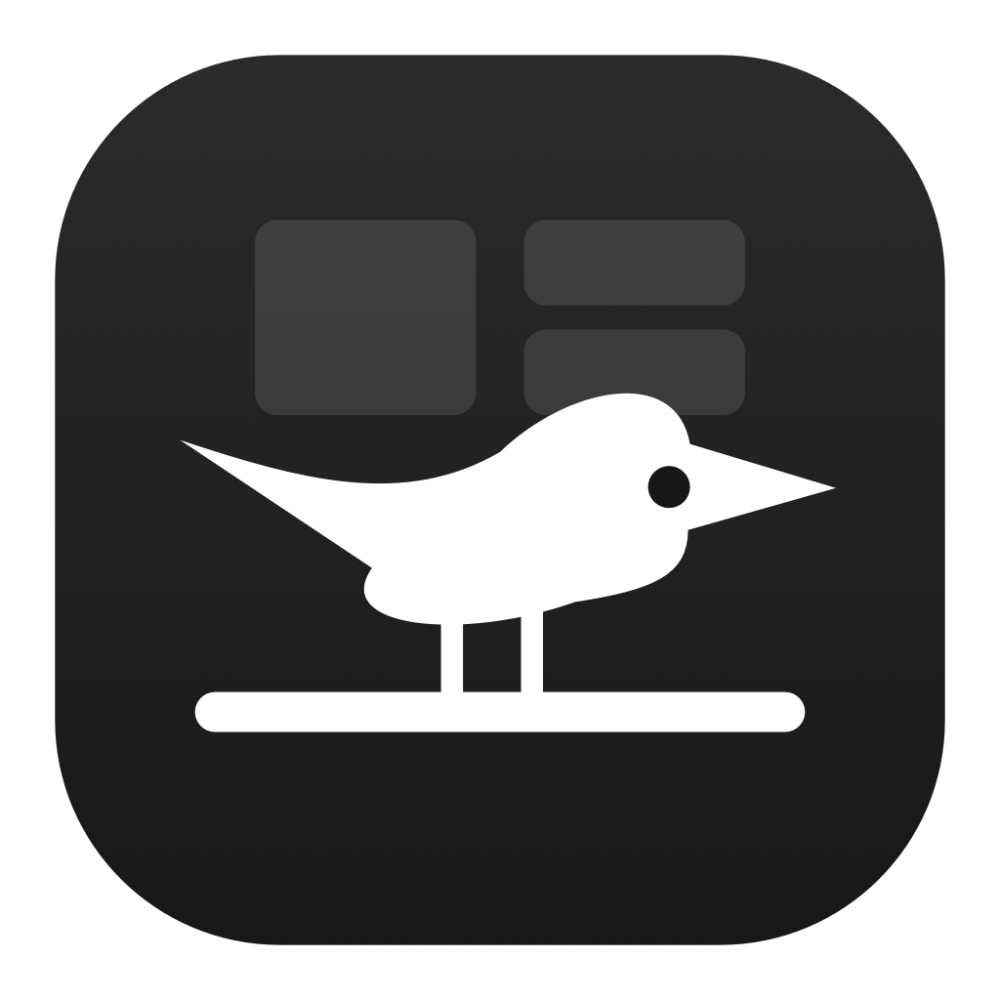

<div align="center">



# Perch

**A dozen Mac utilities in one menu bar icon.**

Window tiling · Clipboard history · Alt-Tab switcher · System monitoring
Night mode · Disk cleaning · Screen, keyboard and trackpad cleaning

[**Website**](https://ishanmalu.github.io/Perch/) · [**Download**](../../releases/latest) · [Changelog](CHANGELOG.md) · [Security](SECURITY.md)

[](https://github.com/ishanmalu/perch/actions/workflows/ci.yml)


</div>

<div align="center">


</div>

---

## Install

Perch is free, open source, and needs macOS 14 or later. The binary is
universal — Apple silicon and Intel — and about 4 MB.

### Download the DMG

```bash
# 1. Download Perch-x.y.z.dmg from the releases page
# 2. Open it and drag Perch to Applications
# 3. Clear the download flag, then open it:
xattr -dr com.apple.quarantine /Applications/Perch.app
```

[**Download the latest release →**](../../releases/latest)

Step 3 is needed because Perch is signed but not notarized — notarizing
requires a paid Apple Developer account. macOS blocks unnotarized downloads
until the flag is cleared.

Prefer not to use the terminal? Open Perch, dismiss the warning, then go to
**System Settings → Privacy & Security**, scroll to **Security**, and click
**Open Anyway**.

> On macOS 15 and later, Control-clicking an app and choosing **Open** no longer
> works for unnotarized apps. Guides that recommend it are out of date.

### Homebrew

```bash
brew tap ishanmalu/tap
brew trust ishanmalu/tap
brew install --cask perch
xattr -dr com.apple.quarantine /Applications/Perch.app
```

`brew trust` is required for any third-party tap. The `xattr` line is still
needed — Homebrew 6 removed `--no-quarantine`, and the app is quarantined
regardless because it is not notarized. Homebrew's advantage here is upgrades,
not a smoother first launch.

### From source

```bash
git clone https://github.com/ishanmalu/perch.git
cd perch
Scripts/install.sh
```

Builds, self-tests, installs to `/Applications` and launches. Swift 6 and the
macOS SDK are enough — full Xcode is not required, and nothing is downloaded,
so there is no quarantine flag to clear.

---

## First run

**1 — Find it.** Perch lives in the menu bar with no Dock icon. Press
`⌃⌥Space` to open the panel at any time.

If a notch or a full menu bar hides the icon, the shortcut still works, and
Perch shows the panel at the top right when it detects the icon is unreachable.

**2 — Grant Accessibility.** System Settings → Privacy & Security →
**Accessibility** → **+** → add `/Applications/Perch.app`.

Required for window tiling, the switcher, Alt-Tab, and the cleaning modes.
Everything else works without it. Perch reads window positions, sizes, titles
and app names — never what is inside a window.

**3 — Optional: live window previews.** Settings → Windows → Grant, or add
Perch under **Screen Recording**. Only needed for Alt-Tab thumbnails; without
it the switcher shows large app icons instead.

**4 — Try it.** With any window focused:

| Press | Result |
| --- | --- |
| `⌃⌥←` | Left half. Press again to cycle ⅓ and ⅔ |
| `⌃⌥↩` | Fill the screen |
| `⌃⌥⌫` | Back to its original size |
| `⌥Tab` | Hold Option, tap Tab, release to switch window |
| `⌘⇧V` | Clipboard history |
| `⌃⌥N` | Night mode |

**5 — Make it yours.** Turn on Launch at Login from the Tools tab, and rebind
anything under Settings → Shortcuts.

> Rectangle, Magnet and AltTab ship some of these same defaults. Whichever
> registered a shortcut first wins, so change one side or quit the other.

---

## What it does

**Window manager.** Halves, thirds, quarters and full screen. Pressing the same
directional shortcut again cycles the width through ½ → ⅓ → ⅔, so one key finds
the size you meant. Configurable gaps, movement between displays, and one
shortcut to undo. Five layouts tile your frontmost windows at once.

**Alt-Tab and the window switcher.** `⌥Tab` holds a grid of live window
previews that grow when fewer windows are open. It lists *windows*, not apps,
so two documents in one app are two entries. Type to filter; while Option is
held, `W` closes a window, `M` minimises it and `Q` quits the app. A separate
title-only switcher lives on ``⌃⌥` `` and can be switched off entirely.

**Clipboard history.** Searchable, with image previews, pinning, source-app
attribution and paste-on-pick. Text, links, colours, files and images are
recognised and shown differently. Anything matching a credential shape —
`sk-`, `ghp_`, `AKIA`, bare JWTs, PEM keys — is skipped automatically.

**System monitoring.** CPU, memory and disk as gauges, with network throughput,
battery level, health and cycle count, load average, thermal state, swap and
memory pressure. Any one stat can sit inline in the menu bar.

**Disk cleaning.** Sixteen built-in targets — user caches, Xcode DerivedData
and device support, npm, yarn, pip, Homebrew, Go, Gradle, CocoaPods, crash
reports, Trash — each with its measured size, plus your own folders with an
optional age filter. Everything is moved to the Trash, never deleted outright.

**Screen cleaning.** Fills every display with flat black so dust and smudges
actually show. Space cycles white, red, green, blue and grey, which doubles as
a dead-pixel test.

**Keyboard and trackpad cleaning.** Keyboard cleaning locks input for a
countdown so you can wipe the keys without typing into anything. Trackpad
cleaning is the complement: the pointer freezes while the keyboard stays live,
so a single `Esc` unlocks it — your hands are nowhere near the keys while
wiping a trackpad, which is the point. Both share one event tap, one countdown
and one failsafe.

**Night mode.** Warms the screen from 6500K to 2400K by rewriting the display
gamma, the same mechanism f.lux and Night Shift use. Because gamma is applied
by the window server underneath everything, it tints the whole screen without
an overlay and never appears in screenshots. Manual, sunset-to-sunrise, or
custom hours. macOS restores the ramps if the process exits, so a crash cannot
leave a display stuck warm.

**Brightness and sleep.** A slider per display — real backlight control for the
built-in panel, software dimming for external monitors so it works over any
cable. Plus a power assertion that keeps the Mac awake until you switch it off.

---

## Shortcuts

| Shortcut | Action |
| --- | --- |
| `⌃⌥Space` | Open the Perch panel |
| `⌘⇧V` | Clipboard history |
| `⌥Tab` | Alt-Tab — hold Option, tap Tab, release to switch |
| ``⌃⌥` `` | Title-only window switcher |
| `⌃⌥←` `→` | Left / right half — press again to cycle ⅓, ⅔ |
| `⌃⌥↑` `↓` | Top / bottom half |
| `⌃⌥D` `F` `G` | Left / center / right third |
| `⌃⌥↩` | Maximize |
| `⌃⌥C` | Center |
| `⌃⌥⌫` | Restore original size |
| `⌃⌥⇧←` `→` | Move to previous / next display |
| `⌃⌥N` | Night mode |
| `⌃⌥K` | Screen cleaning |
| `⌃⌥⇧L` | Keyboard cleaning |
| `⌃⌥⇧T` | Trackpad cleaning |

All rebindable under Settings → Shortcuts. Click a shortcut, press the new
combination; `Esc` cancels.

---

## Updating

**In the app.** The Updates row at the bottom of the panel, or right-click the
menu bar icon → Check for Updates. Automatic checking is off by default and
runs at most once a day when enabled.

Download fetches the DMG, verifies it against the `SHA256SUMS.txt` published
with the release, and reveals it in Finder. Perch does not install updates
itself: an app that can silently replace its own binary from the network is a
much larger thing to trust than one that hands you a verified file —
particularly one already holding Accessibility and input-tap permissions.

**Homebrew.** `brew upgrade --cask perch`

**From source.** `git pull && Scripts/install.sh`

---

## Privacy and security

Perch can see window titles, read the clipboard and intercept keystrokes. That
deserves stating plainly. Full detail in [SECURITY.md](SECURITY.md).

| Capability | Used for | Bounded by |
| --- | --- | --- |
| Accessibility | Window frames, titles, app names | Never reads window contents |
| Screen Recording | Alt-Tab previews | Optional; captures only while the switcher is open |
| Event tap | Swallowing input while cleaning | Counts events; key codes discarded |
| Pasteboard | Clipboard history | `0600` file, filtered (below) |
| Filesystem | Cache measurement and clearing | Path guard, Trash only |
| Network | Update check | Off by default; GitHub only |

**Keystrokes are counted, never recorded.** The cleaning event tap increments a
counter and discards the event. Key codes are not stored, logged or written
anywhere. The tap is torn down on completion, on `Esc`-hold, on quit, and by an
independent failsafe that fires even if the UI wedges.

**Clipboard history is local and permission-restricted**, at
`~/Library/Application Support/Perch/` with the directory `0700` and files
`0600`. It is not encrypted — treat it as readable by anything running as you.
Three filters reduce what lands there: content marked
`org.nspasteboard.ConcealedType`, a configurable list of ignored bundle IDs,
and credential-shaped strings. That last one is a safety net, not a guarantee.

**Disk cleaning cannot be pointed anywhere dangerous.** Custom targets pass a
guard that rejects `/`, `/System`, `/Users`, your home directory and its
important children, relative paths, and anything resolving outside home or a
temp directory. It runs at scan time and again at clean time, so editing
preferences by hand cannot widen it.

Verify any build yourself:

```bash
/Applications/Perch.app/Contents/MacOS/Perch --selftest
```

---

## Building from source

```bash
git clone https://github.com/ishanmalu/perch.git
cd perch
Scripts/make-dmg.sh 1.5.0
```

Swift 6 and the macOS SDK are all that is needed — full Xcode is not required.
The universal binary is produced by compiling each architecture separately and
`lipo`-ing them together, which sidesteps Xcode's multi-arch build system.

| Command | What it does |
| --- | --- |
| `swift build` | Debug build |
| `.build/debug/Perch --selftest` | Run the safety checks |
| `.build/debug/Perch --render-ui <dir>` | Render each panel tab, both appearances |
| `Scripts/install.sh` | Build, verify, install, relaunch |
| `Scripts/build-app.sh` | Signed universal `Perch.app` |
| `Scripts/make-dmg.sh` | The above, wrapped in a DMG |
| `Scripts/setup-signing-identity.sh` | One-time: stable identity for local builds |
| `Scripts/notarize.sh` | Sign, notarize and staple (needs an Apple account) |
| `Scripts/publish-cask.sh` | Update the Homebrew tap from a release |

The app icon is drawn in code ([`Scripts/makeicon.swift`](Scripts/makeicon.swift))
rather than checked in, so it regenerates at any size without design tooling.

```
Sources/Perch/
  Core/        preferences, global hotkeys, HUD, login item, updater
  Windows/     Accessibility wrapper, tiling engine, layouts, switcher, thumbnails
  Clipboard/   pasteboard watcher, persistence, history panel
  System/      CPU/memory/disk/network/battery sampling, disk cleaner, sleep
  Screen/      screen and input cleaning, night mode, brightness
  UI/          design system, menu bar popover, settings, floating panel
```

`SelfTest.swift` holds the safety-critical checks. They ship inside the binary
because XCTest is unavailable with Command Line Tools alone; CI runs them
against both the debug build and the shipped bundle.

**Releasing.** Tag `v*` and push. The workflow builds a signed universal DMG,
self-tests the shipped bundle, publishes it with checksums, and validates that
the Homebrew cask renders. `Scripts/publish-cask.sh <version>` then updates the
tap. See [docs/NOTARIZING.md](docs/NOTARIZING.md) for turning on notarization.

---

## Known limitations

- **Not notarized.** Gatekeeper blocks the download until you clear the
  quarantine flag or click Open Anyway. Notarizing needs a paid Apple Developer
  account; the pipeline is written and inert, waiting on credentials.
- **Clipboard capture polls** twice a second, since macOS offers no change
  notification. An app that copies and immediately loses focus can be
  attributed to the wrong source.
- **Window previews need Screen Recording**, and fall back to app icons
  without it. There is no narrower permission for reading another app's window.
- **Night mode's sunset schedule** uses fixed hours rather than a real solar
  calculation, which would mean asking for your location.
- **External display brightness** is a software overlay, not backlight control.
  It cannot go fully black and will not survive a screenshot.
- **Stage Manager and full-screen windows** are not tiled — macOS owns their
  geometry.

## Licence

MIT — see [LICENSE](LICENSE).
